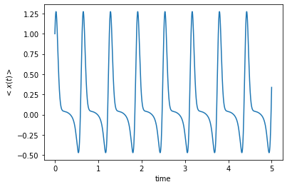
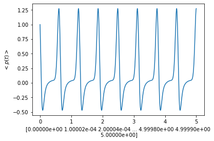
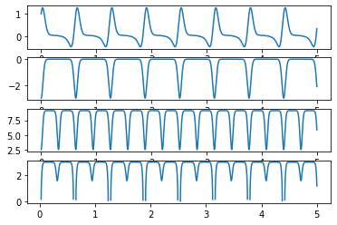

 # Higher Moments Of Observables in a Non-Linear Kerr Medium     
 
 Here the codes and the resulting plots for the observables and their combinations for a Kerr medium are given. The Hamiltonian for the system is given by:
 
 
 $$ H = \hbar\chi(a^{\dagger 2} a^2) $$
 
 We would like to recall that a certain superposition of states in a system, act as a eigen state to the lowering operator $a$, and we call this superposition state, the coherent state $\alpha$ and the time dependent coherent state $\alpha (t)$ is given as:
 {$$\alpha (t) = e^{- \dfrac{{\alpha^2}}{2}} \sum_{n=0}^\infty \dfrac{\alpha^{n}}{\sqrt{n!}} e^{\dfrac{-iHt}{\hbar}}n$$

 The average position with respect to time $<x(t)>$ is plotted as follows.

 $$<x(t)> = e^{- \nu(1-cos(2\chi t)} [p_1 cos(\nu sin2\chi t)+q_1sin(\nu sin2\chi t)]$$
 
 


```python
import matplotlib.pyplot as plt
import warnings
import numpy as np
warnings.filterwarnings("ignore")
```

Let's set $\chi$ to be some positive constant. In our case,we will call it **' f '** and we have set it to be 5.

The value alpha which is the eigen value of the eigen state ket ${\alpha}$, can be written as $p_1 + i q_1$. By changing the values of $p_1$ and $q_1$, we change the way the "system" behaves. 
Initially, let us set $p_1$ and $q_1$ to be equal to 1.
## **We can change the parameters here.**

>>*To add squareroot values, use the keyword "np.sqrt(num)"*

For example, to store the $\sqrt{10}$ in p1, we write:

p1 = np.sqrt(10)


```python
f = 5
p1 = 1
q1 = 1
```

Next, we create arrays to store the position values.
We will call it, for the lack of a better name posx.
Let us define a function ***avgx***, that takes in the values of p1,q1 and stores the **"average of x"** in an array.

`def avgx(p1,q1,array to store the values in)`

Now for the time(x- coordinate), let us create a numpy array **'time'** which stores the values starting from 0, 0.0001, 0.0002,..,4.998,4.999,5. (A total of 50,000 values) 

We call the function once by giving the function **avgx** the parameters, p1,q1, and the posx array, to store the values.Next, we plot the values.


```python
posx = []
 
def avgx(p,q,somearray):
  for t in np.arange(0,5,0.0001):
    mod = p**2 + q**2
    m = np.exp(-mod * (1 - np.cos(2 * f * t)))
    a = p * (np.cos(mod * np.sin(2 * f * t)))
    b = q * (np.sin(mod * np.sin(2 * f * t)))
 
    final = m * (a + b)
 
    somearray.append(final)
 
time = np.linspace(0, 5, 50000)  
 
avgx(p1, q1, posx)
 
plt.plot(time,np.array(posx))
plt.xlabel("time")
plt.ylabel(r"$<x(t)>$")
plt.show()
```


    

    


The expression to find $<p(t)>$ is given as 
$$<p(t)> = e^{- \nu(1-cos2\chi t)}[-p_1 cos(\nu sin2\chi t) + q_1sin(\nu sin2\chi t)]$$
We can write a function to find p(x) similarly.


```python
momx = []

warnings.simplefilter(action='ignore', category=FutureWarning)

time2 = np.linspace(0,5,50000)

def avgp(p,q,somearray):
  for t in np.arange(0,5,0.0001):
    mod = p**2 + q**2
    ins = np.sin(2 * f * t)
    a = np.exp(-mod * (1 - np.cos(2 * f * t)))
    fin = a * (-p * np.sin(mod * ins) + q * np.cos(mod * ins))
    somearray.append(fin)
    
    
avgp(p1,q1,momx)    
plt.plot(time2,momx)
plt.xlabel(time)
plt.ylabel(r"$<p(t)>$")
plt.show()    

```


    

    


These show a very sharp peak at regular intervals, which are multiples of the revival time $T_{rev}$. These peaks become more prominent as the value of $\nu$ increases. 

Similarly, for higher moments of x and p, we would like to plot their values with respect to time.


To find the value of $<L_x^2>$ we find that we can write $<L_x^2>$ as a function of $\beta$ and $\gamma$, where $\beta$ =


```python
p2 = 1
q2 = 2
p3 = 1
q3 = 2

#def change_to_rtheta(p2,q2)


lx = []
lx2 = []
deltalx = []

def l_x(p2,q2,p3,q3,somearray):
    for t in np.arange(0,5,0.0001):
        bsq = p2**2 + q2**2
        gsq = p3**2 + q3**2
        a = np.exp(-1 * (bsq + gsq) * (1 - np.cos(2 * f * t)))
        b = ((p2 * p3) - (q2 * q3)) * np.cos((bsq - gsq) * (np.sin(2 * f * t)))
        c = ((p2 * q3) + (q2 * p3)) * np.sin((bsq - gsq) * (np.sin(2 * f * t)))
        final = a * (b + c) 
        somearray.append(final)
        
l_x(p2,q2,p3,q3,lx)         
        
def l_x_sq(p1,q1,p2,q2,somearray):
    theta2 = np.arctan(p2/q2)
    theta3 = np.arctan(p3/q3)
    r2 = (p2 * np.cos(theta2))**2 + (q2 * np.sin(theta2))**2
    r3 = (p3 * np.cos(theta3))**2 + (q3 * np.sin(theta3))**2
    for t in np.arange(0,5,0.0001):
        a = np.exp(-1 * (1 - np.cos(4 * f * t)) * (r2**2 + r3**2))
        ins = (p2**2) - (p3**2) - (2 * ((theta2 - theta3) * np.sin(4 * f * t)))
        final = -0.5 * (a * (2 * r2**2 * r3**2 * np.cos(ins)) - 2 * r2**2 * r3**2 - r2**2 - r3**2)
        somearray.append(final)
        
  
l_x_sq(p1,q1,p2,q2,lx2) # l x squared function

for i in range(len(lx)):
    if len(lx) == len(lx2):
        value = np.sqrt(lx2[i] - (lx[i]**2))
        deltalx.append(value)

fig ,((ax1),(ax2),(ax3),(ax4)) = plt.subplots(4,1)
ax1.plot(time,np.array(posx))
ax2.plot(time,np.array(lx))
ax3.plot(time,np.array(lx2))
ax4.plot(time,np.array(deltalx))
         
plt.show()
    
```


    

    


```python

```
